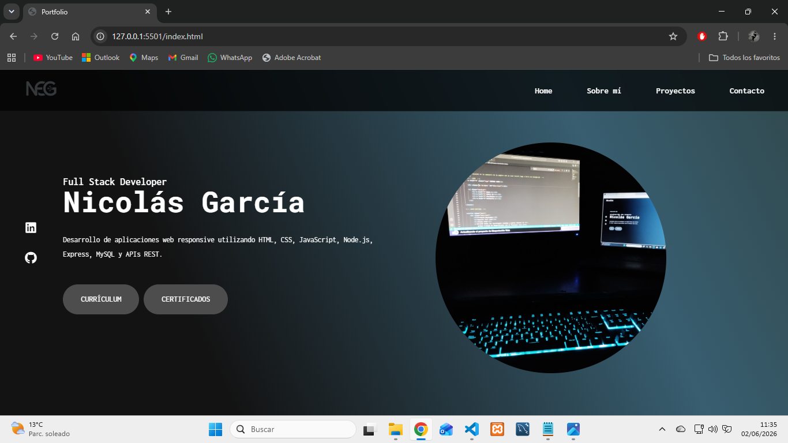
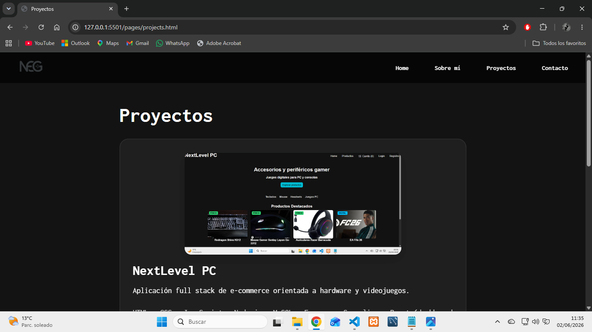
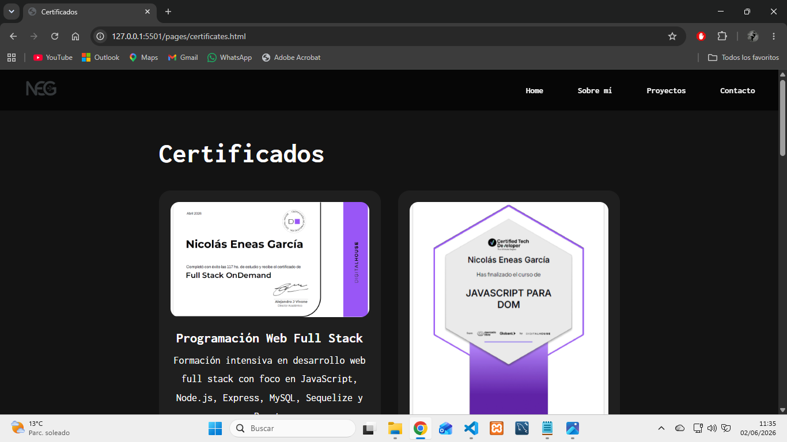
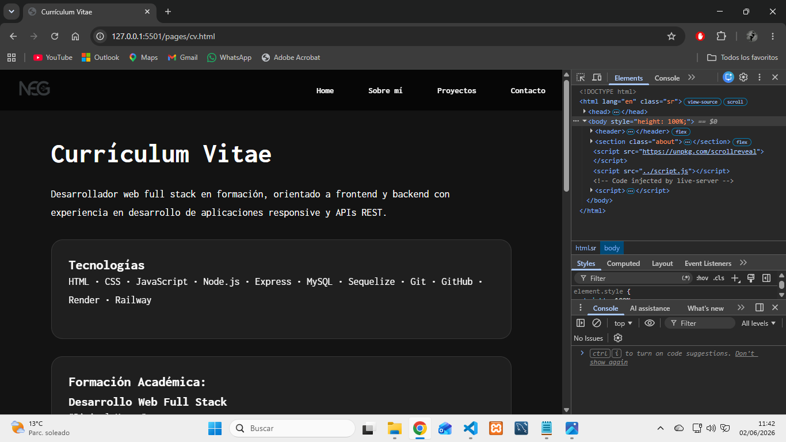
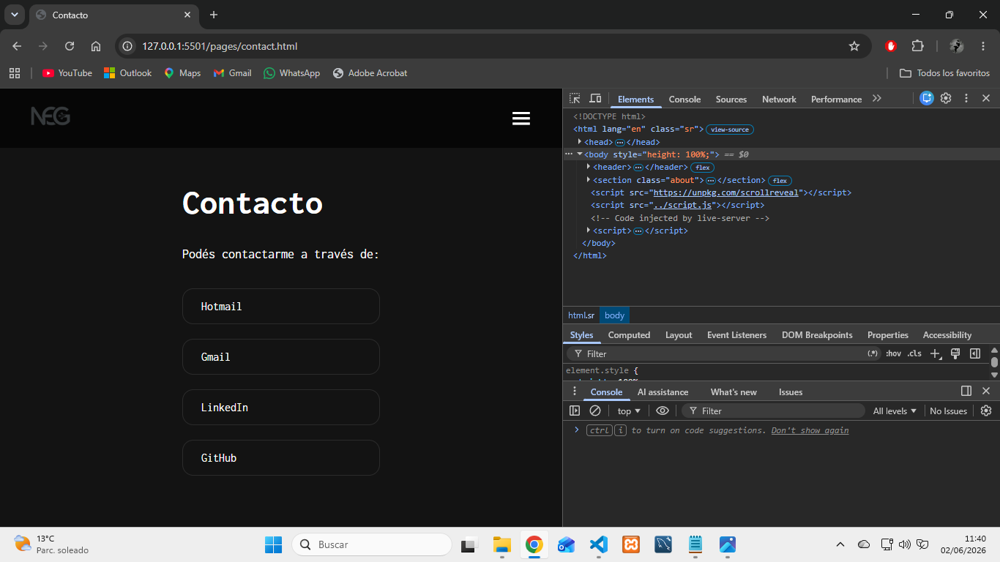
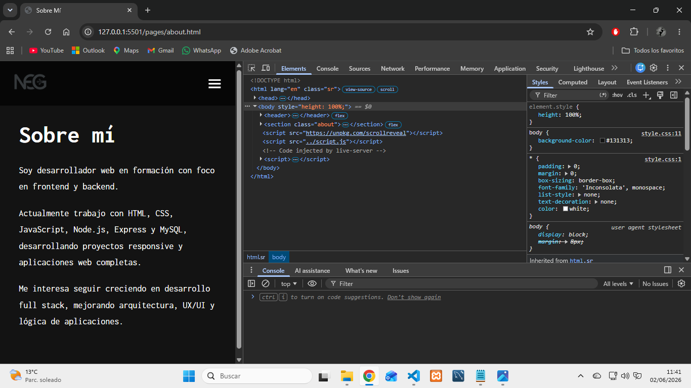

# Portfolio Personal - Nicolás García

Sitio web responsive desarrollado con HTML, CSS y JavaScript para presentar mi perfil profesional, proyectos, certificaciones y currículum vitae.

## 🚀 Características
Diseño responsive
Menú mobile
Navegación multipágina
Sección "Sobre mí"
Portfolio de proyectos
Visualización de certificados
Currículum online y descargable
Integración con GitHub y LinkedIn

## 🛠️ Tecnologías utilizadas
HTML5
CSS3
JavaScript
Boxicons
Remixicon
Google Fonts

📸 Capturas

### Home


### Proyectos


### Certificados


### Responsive






## 📁 Estructura del proyecto

```txt
/assets
├── certificates/
├── screenshots/
  ├── certificates/
  ├── portfolio/
  └── projects/
├── CVNEG.pdf
├── imagen.jpg
└── logo.png
/pages
├── about.html
├── certificates.html
├── contact.html
├── cv.html
└── projects.html
index.html
README.md
script.js
style.css
```

## 🌐 Demo
🔗 (https://portfolio-personal-60ko.onrender.com)

## 👨‍💻 Autor
Nicolas Garcia
🔗 GitHub: [Nicolas-1990](https://github.com/Nicolas-1990)
📧 Email: nicolas_garcia1990@hotmail.com